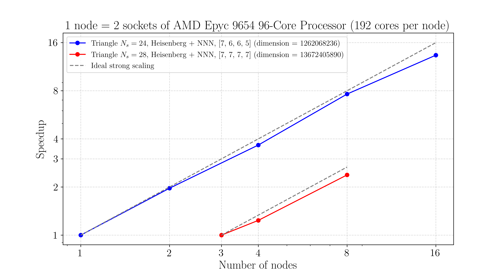

# SU($N$)ED

[](https://github.com/sgozel/SUNED/actions/workflows/tests.yml)

SU($N$)ED is a high-performance C++ exact diagonalization software for solving the SU($N$) Heisenberg model at the largest scales. 

Some of the features of SU($N$)ED are:

- maximally efficient storage strategy for standard Young tableaux (SYTs)
- fast indexing of SYTs
- NUMA-aware first-touch allocation of large arrays
- on-node parallelization with OpenMP
- distributed-memory multi-node parallelization with MPI

## Performance illustration

The figure below shows the speedup (strong scaling) on the matrix-vector multiplication (MVM) obtained on two different systems (Hamiltonian matrix of dimension 1.26 billion and 13.67 billion, respectively), versus number of nodes. Each node has 192 cores. For the small system, the MVM time is approximately 207 seconds on 1 node. For the larger system, the MVM time is approximately 1167 seconds on 3 nodes.



*Details: This plot shows the speedup on the MVM time for the SU(4) Heisenberg model with nearest and next-nearest neighbor interactions on a triangular lattice with 24 sites (blue) (simulation torus: $`\bf{t}_1 = \bf{a}_1 + 4 \bf{a}_2`$, $`\bf{t}_2 = 5\bf{a}_1 - 4\bf{a}_2`$), respectively 28 sites (red) (simulation torus $`\bf{t}_1 = 2\bf{a}_1 + 4 \bf{a}_2`$, $`\bf{t}_2 = 6\bf{a}_1 - 2\bf{a}_2`$). For the 24-sites system (blue), the target sector is the adjoint irreducible representation with Young diagram $`[7, 6, 6, 5]`$, of dimension 1.26 billion. The Hamiltonian is made of 144 bonds ($`2 \times 24 \times 3`$), and the total number of "elementary" operators $`\tau_{k, k+1}`$ to apply in each MVM is 1784. For the 28-sites system (red), the target sector is the singlet irreducible representation with Young diagram $`[7, 7, 7, 7]`$, of dimension 13.67 billion. The Hamiltonian is made of 168 bonds, and the total number of "elementary" operators $`\tau_{k, k+1}`$ to apply in each MVM is 2368. Following the topology of the AMD Epyc 9654 socket, we bind each die of a node to a MPI process, thus 8 cores per MPI process, 24 processes per node. All cores on a die work in parallel on their section of the Hilbert space, which is memory-distributed among all processes. However, memory bandwidth limits the on-die parallel efficiency.*

## Requirements

- [CMake] (minimum version 3.21)
- C++ compiler with standard 20
- OpenBLAS
- OpenMP
- (optional) MPI

SU($N$)ED uses [nlohmann/json] for input parameter files. The single-source header of this library is located in [`src/nlohmann/`](./src/nlohmann/).

## Development requirements

- [GoogleTests]

## Implementation details

SU($N$)ED is shipped with its own efficient and light-weight implementation of the Lanczos algorithm for the diagonalization of the large sparse symmetric (or hermitian) matrix of the Hamiltonian. SU($N$)ED is a matrix-free, or "mainly matrix-free" implementation, which means that the matrix of the Hamiltonian is never built in full form, but, depending on the solver chosen by the user, some intermediate matrices, or lookups, might be generated and stored in memory. This strategy reduces considerably the memory usage required to investigate physical models whose dimension scales exponentially with the system size. OpenBLAS is only used for the diagonalization of the small tridiagonal Hessenberg matrix generated in the course of the Lanczos algorithm.

## Installation

Start by cloning the repository:
```
git clone git@github.com:sgozel/SUNED.git
cd ./SUNED
```

You can then simply invoke the `Makefile` at the root of the directory:
```
make
```
This will build the MPI executables for energy eigenvalues, eigenpairs and correlations with some predefined configuration (see below). Alternatively, you can configure you own specific build using the usual CMake commands:
```
cmake -S . -build build/release_special_build/ -DCMAKE_BUILD_TYPE=Release <SUNED OPTIONS>
cmake --build build/release_special_build/
```
where the `<SUNED OPTIONS>` are described in the next section.

## Options

The following options can be provided to the cmake command at configure time to customize the build:

| Option | Description | Default value |
| ------ | ------ | ------ |
| `SUNED_EIGVALS` | Build eigenvalue extraction only (no eigenvector) | `ON` |
| `SUNED_EIGVECS` | Build eigenvector extraction | `OFF` |
| `SUNED_CORRELATIONS` | Build correlations extraction | `OFF` |
| `SUNED_USE_MPI` | Build MPI implementation for multi-node distributed-memory version | `ON` |
| `SUNED_LANCZOS_TWO_VECTORS` | Build Lanczos with two vectors | `OFF` |
| `SUNED_USE_NUMA` | Use NUMA-aware memory allocation of Lanczos vectors | `OFF` |
| `SUNED_STORE_COLUMNS` | Store column-SYTs instead of rows-SYTs | `OFF` |
| `SUNED_USE_VSYT` | Build with basic storage strategy for SYTs | `OFF` |
| `SUNED_BSYT_NBITS` | Number of bits per box for `bSYT` | 2 |
| `SUNED_BSYT_CONTAINER_SIZE` | Number of bytes per SYT for `bSYT` | 8 |

`SUNED_USE_VSYT=ON` leads to a larger memory usage and a less efficient (slower) search across SYTs. It is also slower when applying transpositions on SYTs. It is thus not recommended for production runs. See [this page](src/sun/syt/README.md) for more details.


Before executing the code, set the OMP variables:
```
export OMP_NUM_THREADS=...
export OMP_PROC_BIND=close
export OMP_PLACES=cores
```

## Input parameters

The following table describes all possible input parameters to the `SUNED` executables, with their eventual default values. These parameters can be fed to the executables in two different compatible ways:
- as a flat `.json` file, such as the one provided at the root of the `SUNED` directory;
- as command line `--key value` pairs on the call of the executable.

The rule is that any `--key value` pair provided on the command line will override the associated pair in the input `.json` file, if provided. We provide below a few illustrative examples.

| Input | Description | Default value if optional |
| ------ | ------ | ------ |
| `N` | SU($N$) |  |
| `Ns` | Number of sites |  |
| `alpha` | Target sector (irrep) |  |
| `latticefile` | Path to lattice file |  |
| `seed` | Seed for Lanczos initialization vector | 42 |
| `max_iter` | Maximum number of Lanczos iterations | 1000 |
| `tol_ritz` | Tolerance on Ritz value stabilization in Lanczos | 1e-12 |
| `tol_residual` | Tolerance on residual in Lanczos | 1e-12 |
| `convergence_check_frequency` | Frequency of convergence check in Lanczos | 1 |
| `dump_eigvec` | Write eigenvector to file | true |
| `eigvec_folder_path` | Folder path for eigenvector  | `.` |
| `logging` | Log convergence data during Lanczos | true |
| `logging_full` | Log full spectrum during Lanczos | false |
| `logging_folder_path` | Folder path for logging data | `.` |
| `logging_frequency` | Logging frequency | 1 |
| `checkpointing` | Checkpoint Lanczos iterations for restarting | false |
| `checkpoint_folder_path` | Folder path for checkpoints | `.` |
| `checkpoint_frequency` | Checkpointing frequency | 5 |
| `keep_checkpoint` | Keep checkpoint on disk after convergence | false |
| `dump_matrices` | Write matrices $\tau_{k, k+1}$ to file | false |
| `matrix_dump_folder_path` | Folder path for $\tau_{k, k+1}$ | `.` |
| `correlation_refsite` | Reference site $i$ for correlations $`\left<P_{i, j}\right>, \ \forall j`$ | 0 |


### Example 1 - Use only the `.json` input parameter file

```
/path/to/main data.json
```

### Example 2 - Use only command-line arguments

```
/path/to/main --N 4 --Ns 10 --alpha '[3,3,2,2]' --latticefile /path/to/latticefiles/HB_chain_10_OBC.lattice --J 1.0
```
This is the simplest minimal example for running a job with `SUNED`.

### Example 3 - Mix the best of both worlds

```
/path/to/main data.json --checkpointing true --checkpoint_folder_path /scratch/jobid2026/
```
This is the most useful when executing jobs on a cluster, in particular for job arrays.

## Lattice files

SU($N$)ED will read a lattice file (whose path is provided in the input `.json` file, with key `latticefile`). A lattice file is a very generic description of the geometric lattice, and of the underlying interactions. It must have the following structure:

```
[sites]=<number of sites>
0 x0 y0 z0
1 x1 y1 z1
2 x2 y2 z2
...
[interactions]=<number of interactions (bonds)>
couplingName0 (siteA0, siteB0)
couplingName1 (siteA1, siteB1)
...
```
where `x0`, `y0`, `z0` are the $x$, $y$ and $z$ coordinates of the first site, labelled $0$, and similarly for all other sites. There must be exactly `<number of sites>` rows with this format after the `[sites]=<number of sites>` instruction. Each line after the `[interactions]=<number of interactions (bonds)>` instruction begins with the name of a coupling constant, which is then followed by a cycle (in the permutation sense) which describes the sites involved in the interaction.

Below are two examples of lattices.

**Chain lattice with 5 sites and open boundary conditions, with isotropic nearest neighbor coupling $J$**
```
[sites]=5
0 0 0 0
1 1 0 0
2 2 0 0
3 3 0 0
4 4 0 0
[interactions]=4
J (0, 1)
J (1, 2)
J (2, 3)
J (3, 4)
```

**Chain lattice with 5 sites and periodic boundary conditions, with isotropic nearest neighbor coupling $J$ and second-nearest neighbor coupling $K$**
```
[sites]=5
0 0 0 0
1 1 0 0
2 4 0 0
3 2 0 0
4 3 0 0
[interactions]=10
J (0, 1)
J (1, 3)
J (3, 4)
J (2, 4)
J (0, 2)
K (0, 3)
K (1, 4)
K (2, 3)
K (0, 4)
K (1, 2)
```

The coupling name(s) must then be provided in the `.json` file with their numerical value(s). For instance, for the 5-sites chain with coupling constants $J$ and $K$:
```
"N": 3,
"Ns": 5, 
"alpha": [2, 2, 1],
"latticefile": "/path/to/latticefile.lattice",
"J": 1.0,
"K": -0.5,
...
```

Note that in the case of the 5-sites periodic chain above, we did not number the sites in a sequential way when turning around the ring. This is a general optimization. Indeed, the algorithmic complexity of this ED algorithm is linear in the total number of elementary operators $`\tau_{k, k+1}`$ (adjacent transpositions) to apply, which we denote by $`\mathcal{C}`$. For a given lattice, it is thus useful to find a numbering of the sites which reduces $`\mathcal{C}`$, and, ideally, minimizes it. This problem is known as the *Minimum Linear Arrangement Problem*, a well-known NP-hard problem in combinatorial mathematics. We have thus developed [lattice_optimizer], a C++ application which takes a $`N_s`$-sites lattice (sites + bonds) file in input and finds a renumbering $`\sigma \in S_{N_s}`$ of the sites which decreases $`\mathcal{C}`$, and, hopefully, minimizes it given the relatively small number of sites adressable with ED.

[lattice_optimizer] also provides a convenient Python script for plotting a lattice.

## Tests

To compile tests:
```
make build_tests_mpi
```

## Significant others

The three following reposittories, written by the same author, are closely related to SU($N$)ED:

- [lattice_optimizer]: reduce the computational cost of ED by performing a graph optimization based on the specified Hamiltonian.
- [suned_analysis]: a set of Python scripts to plot data obtained with SU($N$)ED, in particular ED spectra.
- [SUN4Py]: an extended Python library to perform ED and DMRG calculations on SU($N$) models.

## Citation

If you use any of the codes of this repository in your work, you are invited to cite it as explained in the `CITATION.cff` file. Your are also invited to cite the following article:

```
@article{nataf_exact_2014,
	title = {Exact Diagonalization of Heisenberg $\mathrm{SU}(N)$ Models},
	author = {Nataf, Pierre and Mila, Fr\'ed\'eric},
	journal = {Phys. Rev. Lett.},
	volume = {113},
	issue = {12},
	pages = {127204},
	numpages = {5},
	year = {2014},
	month = {Sep},
	publisher = {American Physical Society},
	doi = {10.1103/PhysRevLett.113.127204},
	url = {https://link.aps.org/doi/10.1103/PhysRevLett.113.127204}
}
```

## License

The code is licensed under GNU GPL-v3.0 as given in the file LICENSE.

## Author

Samuel Gozel


[CMake]: <https://cmake.org/>
[nlohmann/json]: <https://github.com/nlohmann/json>
[GoogleTests]: <https://github.com/google/googletest>
[lattice_optimizer]: <https://github.com/sgozel/lattice_optimizer>
[suned_analysis]: <https://github.com/sgozel/suned_analysis>
[SUN4Py]: <https://github.com/SUN4Py/SUN4Py>
